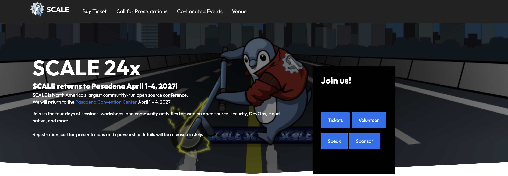

# SCaLE Website (`scale-drupal`)

Welcome! This is the repository for [socallinuxexpo.org](https://www.socallinuxexpo.org) — the public site and talk review tools for the Southern California Linux Expo (SCaLE).

SCaLE is North America's largest community-run free and open source software conference, held annually since 2002. This site is built, maintained, and evolved entirely by volunteers like you.

Built with Drupal 10 and PHP 8, with a Gulp and Tailwind theme. Local development runs on Lando.



## Features

- **Conference site**: multi-day, multi-track schedule, speaker profiles, sponsor and exhibitor pages, and the blog
- **Call for papers**: speakers submit talks through the site, and each submission becomes content the program committee works with directly
- **Talk review tooling**: rating submissions, reviewer comments, filtering by track, and comparing a speaker's history across past conferences
- **Multi-year**: every conference year lives in one site, with content scoped to the active event
- **Configuration as code**: the site's entire structure is exported to YAML and version controlled alongside the code

## Prerequisites

- [Docker](https://www.docker.com/products/docker-desktop/)
- [Lando](https://docs.lando.dev/getting-started/installation.html)
- [Node and npm](https://nodejs.org/) — only for theme work, since the theme build runs outside the container

PHP, Composer, and the database all run in containers, so you don't need those installed locally.

## Quick start

```bash
git clone git@github.com:socallinuxexpo/scale-drupal.git
cd scale-drupal
lando start
```

The site comes up at **https://scale10.lndo.site**.

That gets the containers running, but not a working site — with no database, Drupal redirects to its installer. Contributions also go through forks rather than direct clones.

For the full database setup guide and everyday development commands (`drush cex`, `drush cim`, cache rebuilds), see [CONTRIBUTING.md](CONTRIBUTING.md).

## Repository map

```
scale-drupal/
├── config/sync/                  # the site's entire configuration, as YAML
├── web/                          # docroot
│   ├── modules/custom/           # SCaLE-specific modules
│   │   ├── active_event/         # tracks which conference year is live
│   │   ├── sessions/             # session content helpers
│   │   ├── session_enhancements/ # time slot defaults and auto-population
│   │   ├── custom_access/        # content access control
│   │   ├── views_plugins/        # Views plugins for the talk review pages
│   │   ├── hero_block/           # landing page hero component
│   │   ├── utility/              # site-wide helpers
│   │   └── d10_migration/        # Drupal 7 → 10 migration (archival)
│   ├── modules/contrib/          # Composer-managed — don't edit
│   ├── themes/custom/scale/      # the theme
│   │   ├── src/                  # source CSS and JS — edit these
│   │   ├── components/           # reusable component templates
│   │   ├── templates/            # Twig templates
│   │   └── dist/                 # compiled output — generated, but committed
│   └── core/                     # Drupal core — don't edit
├── private/scripts/              # deploy hooks
├── composer.json                 # PHP dependencies
└── .lando.yml                    # local development environment
```

## Branches

| Branch | |
|---|---|
| `master` | Active development. Base your work here. |
| `master-archive` | The Drupal 7 site that ran until 2025. Reference only. |

The two have entirely separate histories — the Drupal 10 site was built fresh rather than upgraded in place. If you find older references to a `drupal10` branch, that's what `master` is now.

## Contributing

See [CONTRIBUTING.md](CONTRIBUTING.md).

## License

GNU General Public License v2.0 or later, the same license as Drupal core. See [LICENSE](LICENSE).
